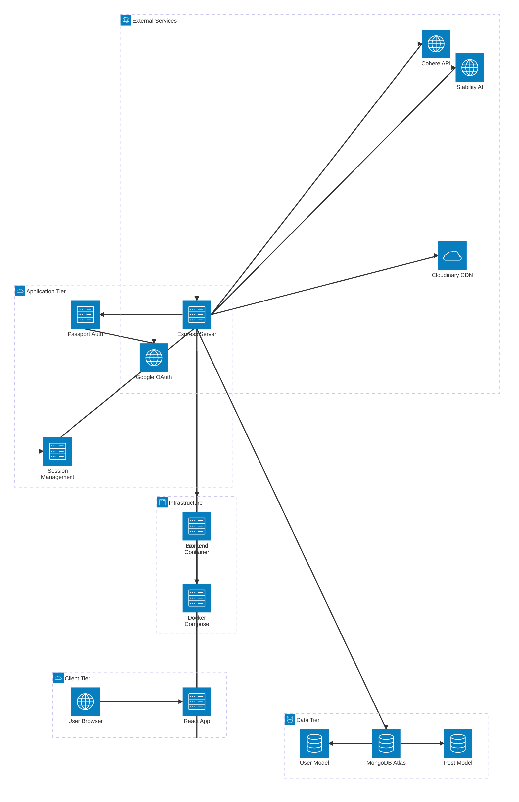

# GYAANI - AI Image Explorer Architecture Diagram

This diagram shows the complete architecture of the GYAANI application, including all components, services, and their relationships.

## Architecture Components

### Client Tier
- **User Browser**: Web browser where users interact with the application
- **React App (Vite)**: Frontend React application built with Vite, styled with Tailwind CSS

### Application Tier
- **Express.js Server**: Main backend server handling API requests and business logic
- **Passport.js Auth**: Authentication middleware managing Google OAuth flow
- **Session Management**: Express-session handling user sessions and authentication state

### Data Tier
- **MongoDB Atlas**: Cloud-hosted NoSQL database
- **User Model**: Stores user profile information from Google OAuth
- **Post Model**: Stores AI-generated images and metadata

### External Services
- **Google OAuth 2.0**: Authentication provider for secure user login
- **Stability AI API**: AI service for generating images from text prompts
- **Cohere API**: AI service for generating text responses to queries
- **Cloudinary CDN**: Image hosting and delivery service

### Infrastructure
- **Backend Container**: Dockerized Express.js server
- **Frontend Container**: Dockerized React application  
- **Docker Compose**: Orchestrates multi-container deployment

## Data Flow

1. **Authentication Flow**:
   - User accesses React app in browser
   - Login redirects to Express server
   - Passport.js handles Google OAuth flow
   - User data stored in MongoDB
   - Session created for authenticated user

2. **Image Generation Flow**:
   - Authenticated user submits prompt via React app
   - Express server calls Stability AI API
   - Generated image uploaded to Cloudinary
   - Image metadata saved to MongoDB
   - Image displayed in React app

3. **Text Query Flow**:
   - User submits text query via React app
   - Express server calls Cohere API
   - AI response returned to React app

4. **Community Showcase Flow**:
   - React app fetches posts from Express server
   - Server retrieves post data from MongoDB
   - Images served from Cloudinary CDN
